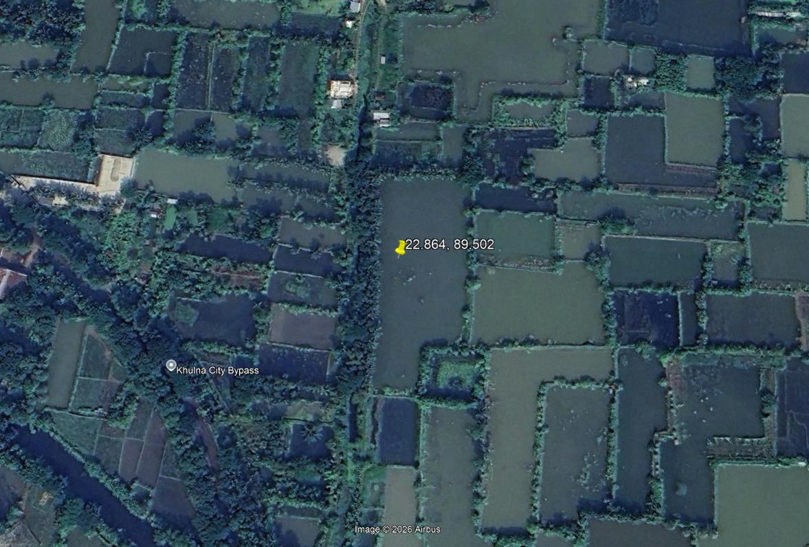
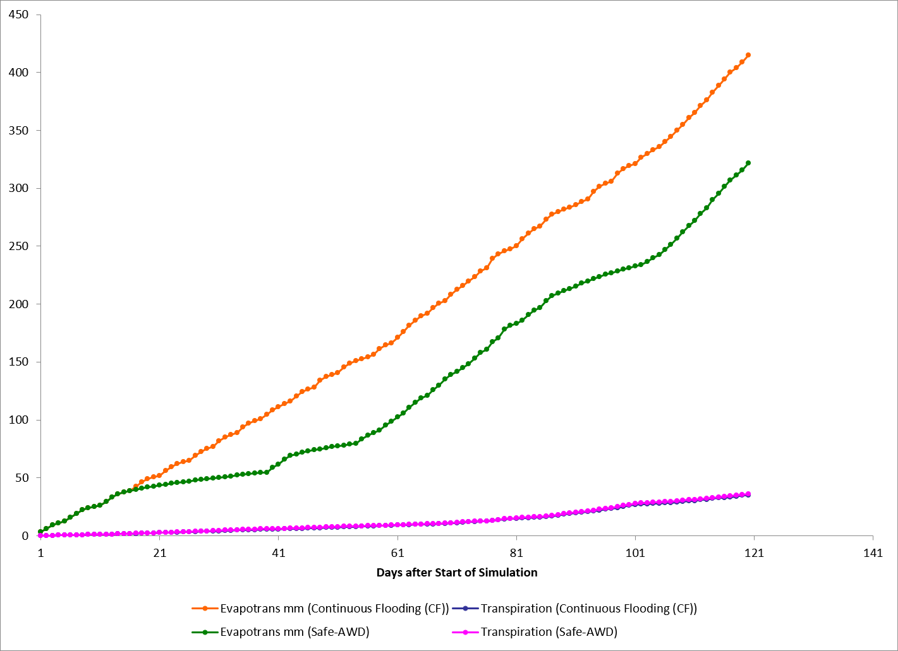
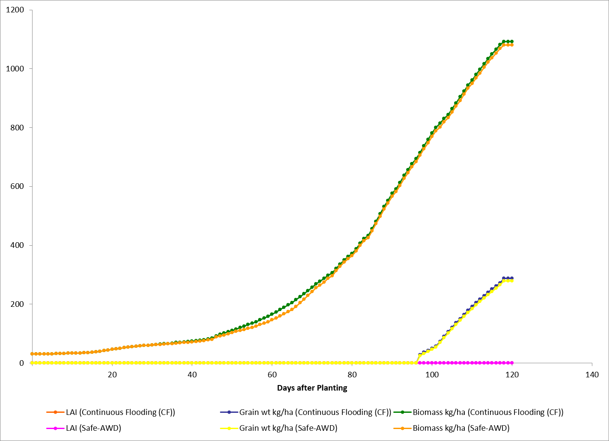
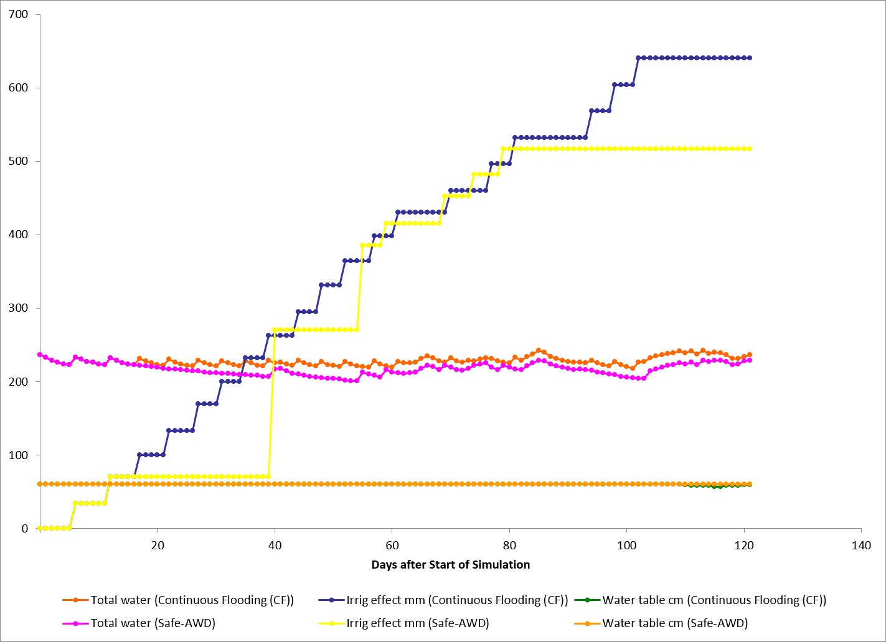

# Agro-Hydrological Modeling and Carbon Footprint Assessment of Boro Rice under Alternate Wetting and Drying (Safe-AWD) vs. Continuous Flooding

### A Case Study of Aronghata, Khulna

  
  
  
  

---

**Author:** Md Shakawat Hossain  
**Department:** Department of Farm Power and Machinery  
**Faculty:** Faculty of Agricultural Engineering and Technology  
**Institution:** Khulna Agricultural University, Khulna, Bangladesh  
**Model Tools Used:** DSSAT v4.8.6.000 (CERES-Rice module) and the FAO-56 Penman-Monteith method
**Date:** September 22, 2026

> **Note:** This is a practice project, not a field research study. Most soil, crop-management and irrigation input values used in the model are empirical or assumed values taken from general references, not from laboratory tests or field measurements on this site. The purpose was to practice building and running the modeling pipeline and to compare the two water-management methods. This is explained in more detail in Section 2 and Section 6.

---

## Table of Contents

1. [Summary](#1-summary)
2. [Method](#2-method)
   - [2.1 Study Site and Geographic Coordinates](#21-study-site-and-geographic-coordinates)
   - [2.2 Weather data](#22-weather-data)
   - [2.3 Water use and irrigation schedule](#23-water-use-and-irrigation-schedule)
   - [2.4 Soil information](#24-soil-information)
   - [2.5 Crop and management setup](#25-crop-and-management-setup)
   - [2.6 Note on the methane (CH4) estimate](#26-note-on-the-methane-ch4-estimate)
3. [Results](#3-results)
4. [Discussion](#4-discussion)
   - [4.1 Where the water saving comes from](#41-where-the-water-saving-comes-from)
   - [4.2 Crop growth and yield](#42-crop-growth-and-yield)
   - [4.3 Estimated methane change](#43-estimated-methane-change)
5. [Figures](#5-figures)
6. [Data Sources and Assumptions](#6-data-sources-and-assumptions)

---

## 1. Summary

This project compares two water-management methods for Boro rice grown at Aronghata, Khulna, during the 2026 season: Continuous Flooding (CF), the common practice, and Safe Alternate Wetting and Drying (Safe-AWD), a water-saving method. The comparison was done using a computer model (DSSAT, CERES-Rice module) together with the FAO-56 method for calculating water use, rather than a field trial.

The results from the model show that Safe-AWD used noticeably less irrigation water than continuous flooding, needed fewer irrigation events, and did not cause any water-stress penalty to the crop in the simulation. Grain yield was almost the same under both methods.

- **Irrigation water used:** 639.9 mm under CF, compared to 516.5 mm under Safe-AWD — a saving of about 123.4 mm (around 19%).
- **Number of irrigation events:** 19 under CF, compared to 8 under Safe-AWD — 11 fewer pumping events (about 58% fewer).
- **Simulated water-stress index:** 0.000 (no stress) under both methods, at every growth stage.
- **Grain yield:** 287 kg/ha under CF and 279 kg/ha under Safe-AWD — a small difference of about 3%.

The yield values above are low compared with normal field yields. This is because no nitrogen fertilizer was applied in either simulation (0 kg N/ha). This was done on purpose, so that the comparison would show only the effect of the water-management method, without fertilizer use affecting the result. Because of this, the yield numbers should not be treated as an estimate of what a real, fertilized field would produce.

As explained in Section 2 and Section 6, the soil properties, crop-management dates, and irrigation amounts used in the model were not measured in the field or in a laboratory. They are empirical (assumed) values taken from general references and from the model's own calculations, used to test and practice the modeling process.

---

## 2. Method

The work was done across structured steps: defining site geographic parameters, acquiring weather data, calculating water use and irrigation schedules, setting up soil and crop information, and running the DSSAT crop model for the two water-management methods.

### 2.1 Study Site and Geographic Coordinates

- **Location:** Aronghata, Khulna Sadar / Khan Jahan Ali Thana, Khulna District, South-Western Coastal Region, Bangladesh.
- **Geographic Coordinates:** Latitude: 22.864° N (22.88° N grid centroid), Longitude: 89.502° E (89.51° E grid centroid).
- **Elevation:** ~4.0 m above mean sea level.
- **Agro-Ecological Zone:** AEZ 13 (Ganges Tidal Floodplain, Non-saline coastal alluvium zone).

  

_Figure: High-resolution satellite basemap showing the Aronghata, Khulna modeling site (22.864° N, 89.502° E) within the Ganges Tidal Floodplain (AEZ 13), Bangladesh._

### 2.2 Weather data

- Daily weather data (solar radiation, maximum and minimum temperature, rainfall, wind speed, and relative humidity) were downloaded from the NASA POWER database for the Aronghata, Khulna location (22.88° N, 89.51° E, elevation 4.0 m).
- This data was arranged into the weather-file format DSSAT needs (file name `BDAR2601.WTH`).
- Total rainfall over the 120-day crop period was 336.2 mm, the same for both simulations, since both used the same weather record.

### 2.3 Water use and irrigation schedule

- Daily crop water use (evapotranspiration) was calculated using the standard FAO-56 Penman-Monteith method, in Python.
- Crop coefficients were used at different growth stages to work out when the soil would need irrigation under each method.
- **Safe-AWD rule:** irrigate back up to 5 cm of standing water whenever the water table dropped to 15 cm below the soil surface, except during flowering, when the field was kept flooded.
- **Continuous Flooding (CF):** the field was kept flooded with a shallow water layer for the whole season, as is common practice.

#### FAO-56 Penman-Monteith Equation

Used to calculate reference evapotranspiration ($ET_o$):

$$ET_o = \frac{0.408 \Delta (R_n - G) + \gamma \left(\frac{900}{T + 273}\right) u_2 (e_s - e_a)}{\Delta + \gamma (1 + 0.34 u_2)}$$

Where:

- $R_n$ is net radiation
- $G$ is soil heat flux
- $T$ is mean daily air temperature
- $u_2$ is wind speed at 2 m
- $e_s - e_a$ is the vapour pressure deficit
- $\Delta$ is the slope of the saturation vapour pressure curve
- $\gamma$ is the psychrometric constant

> **Note on irrigation dates:** The irrigation dates and water-table depths were first worked out separately using the FAO-56 daily water-balance calculation, assuming typical percolation behaviour for puddled coastal clay soil. When this was carried over into the DSSAT soil-layer model, a standard drainage setting ($SLDR = 0.40$) was used to represent water movement through the 0–60 cm soil profile.

### 2.4 Soil information

> **Note:** The soil properties used in the model were not measured from a soil sample taken at this site. They were assumed values, based on typical figures reported in the literature for Ganges tidal alluvium soil with a silty clay loam texture (DSSAT soil type code `SICL`, soil ID `BDAR000001`). This was done for practice and to test the modeling steps, not as a substitute for a real soil test.

- **Soil depth divided into layers:** 0–5, 5–15, 15–30, 30–45, and 45–60 cm.
- **Water-holding values (assumed):** wilting point 0.18–0.21 cm³/cm³; field capacity 0.38–0.40 cm³/cm³; saturation 0.46–0.48 cm³/cm³.
- **Bulk density (assumed):** 1.36–1.45 g/cm³.
- **Organic carbon (assumed):** about 0.95% near the surface, decreasing to 0.33% at depth.
- **Soil pH (assumed):** 6.9–7.2.
- **Hydraulic settings:** Runoff curve number: 75.0; Drainage rate: 0.40; Surface albedo: 0.13; Evaporation limit: 6.0 mm.

### 2.5 Crop and management setup

- **Crop:** rice (_Oryza sativa L._), variety BR 3 (Boro). DSSAT variety code `IB0027`. The genetic growth parameters for this variety ($P_1, P_{2R}, P_5, P_{2O}, G_1, G_2, G_3$) were taken directly from DSSAT's built-in variety list; they were not adjusted or calibrated for this study.
- **Transplanting:** 30-day-old seedlings were transplanted on 15 January 2026; the crop reached maturity on 15 May 2026 (120 days after transplanting). Row spacing 20 cm; plant density 25 plants per m².
- **Nutrient control:** No nitrogen fertilizer was applied in either simulation (0 kg N/ha), so that the comparison would reflect only the effect of the water-management method.

### 2.6 Note on the methane (CH4) estimate

> **Note:** Methane emissions were not measured in the field (for example, with gas-sampling chambers). The estimated 34% drop in methane under Safe-AWD is a calculated estimate only. It comes from combining the daily water-table pattern from the FAO-56 water balance with standard IPCC Tier-2 emission factors for rice fields under different water regimes.

Under continuous flooding, the soil stays wet and low in oxygen for the whole season, which is the condition under which methane-producing microbes are most active (this corresponds to a Tier-2 scaling factor of 1.0). Under Safe-AWD, the field dries out periodically before being re-flooded, which lets oxygen back into the soil. This slows down methane production and allows methane-consuming microbes to become more active, which is why the Tier-2 method gives a lower emission estimate for Safe-AWD.

Because this number comes from a calculation, not a field measurement, it should be described as an estimate of possible methane reduction, not as a measured result.

---

## 3. Results

Table 1 below shows the main results taken from the DSSAT output file (`OVERVIEW.OUT`) for the two simulations: Run 1 (Continuous Flooding) and Run 2 (Safe-AWD).

### Table 1. Comparison of results between Continuous Flooding and Safe-AWD

| Measure                             |         CF         |  Safe-AWD   | Difference  | Comment                            |
| :---------------------------------- | :----------------: | :---------: | :---------: | :--------------------------------- |
| **Total irrigation applied**        |      639.9 mm      |  516.5 mm   |  −123.4 mm  | About 19% less water used          |
| **Number of irrigation events**     |         19         |      8      |     −11     | About 58% fewer pumping events     |
| **Seasonal rainfall**               |      336.2 mm      |  336.2 mm   |   0.0 mm    | Same weather data used for both    |
| **Water-stress index**              |       0.000        |    0.000    |    0.000    | No stress simulated in either case |
| **Evapotranspiration (total)**      |      414.8 mm      |  321.7 mm   |  −93.1 mm   | Mostly less soil evaporation       |
| **Plant transpiration**             |      35.7 mm       |   36.7 mm   |   +1.0 mm   | Almost unchanged                   |
| **Grain yield (dry weight)**        |     287 kg/ha      |  279 kg/ha  |  −8 kg/ha   | Small difference, about 3%         |
| **Total crop biomass**              |    1,092 kg/ha     | 1,080 kg/ha |  −12 kg/ha  | Almost the same                    |
| **Harvest index**                   |       0.263        |    0.258    |   −0.005    | Almost unchanged                   |
| **Yield per m³ irrigation water**   |     0.04 kg/m³     | 0.05 kg/m³  | +0.01 kg/m³ | Better water-use efficiency        |
| **Biomass per m³ irrigation water** |     0.17 kg/m³     | 0.21 kg/m³  | +0.04 kg/m³ | Better water-use efficiency        |
| **Estimated methane change**        | Higher (reference) |    Lower    | About −34%  | Estimated, not measured (see 2.6)  |

The water-use efficiency figures show that although Safe-AWD used less water overall, it produced slightly more grain and biomass for each cubic metre of irrigation water applied, compared with continuous flooding.

---

## 4. Discussion

### 4.1 Where the water saving comes from

The model output shows that almost all of the water saved under Safe-AWD comes from a reduction in soil and surface evaporation, not from a reduction in how much water the plant itself uses. Season-total soil evaporation was about 379.7 mm under CF, compared to about 285.7 mm under Safe-AWD — a difference of roughly 94 mm. Plant transpiration, on the other hand, stayed almost the same: about 35 mm under CF and about 36 mm under Safe-AWD.

This matters because it means the crop was not short of water at any point — the water saved was water that would otherwise have evaporated from the wet soil surface, not water the plant needed. This is also why the water-stress index stayed at 0.000 for both methods throughout the season.

#### Figure A. Plant water use compared with soil evaporation

  

_Plant water use (blue) is almost the same for both methods (about 35 mm for CF and 36 mm for Safe-AWD). Soil evaporation (orange) drops noticeably, from about 380 mm under CF to about 286 mm under Safe-AWD. This shows that the water saving under Safe-AWD mainly comes from less evaporation, not less water use by the plant._

### 4.2 Crop growth and yield

The model shows that the crop reached each growth stage on the same day under both methods: panicle initiation at 54 days, flowering at 90 days, and maturity at 120 days after planting. Maximum leaf area was also the same (0.13) in both cases. This shows that the Safe-AWD water schedule did not delay or speed up crop development compared with continuous flooding.

As mentioned earlier, the low yield values (287 and 279 kg/ha) are a result of the zero-fertilizer setting used in both simulations, not a result of the water-management method. This setting was chosen on purpose so that the water-management comparison would not be affected by differences in nitrogen supply. With normal fertilizer use, yields under both methods would be expected to be much higher, although the general pattern of the comparison between CF and Safe-AWD would likely stay similar.

### 4.3 Estimated methane change

Continuous flooding keeps the soil wet and low in oxygen for the whole season. This is the condition in which methane-producing microbes in the soil are most active. Safe-AWD lets the field dry out periodically before re-flooding, which brings oxygen back into the topsoil. This slows down methane production during the dry period and allows methane-consuming microbes to become more active. Based on these water-table patterns and standard emission factors, the estimated methane reduction under Safe-AWD is about 34%.

As noted in Section 2.6, this is a calculated estimate based on water-table data and standard emission factors, not a value measured from gas samples taken in the field.

---

## 5. Figures

The figures below are taken from the DSSAT simulation output files (`ET.OUT`, `PlantGro.OUT` and `SoilWat.OUT`) for the two water-management methods.

#### Figure 1. Evapotranspiration and transpiration over time

  

_Cumulative evapotranspiration, soil evaporation, and transpiration (×10) over the growing season, for Continuous Flooding and Safe-AWD. From around day 40 onward, the evapotranspiration lines for the two methods start to separate, mainly because of lower soil evaporation under Safe-AWD, while the transpiration lines for both methods stay close together._

#### Figure 2. Crop biomass and grain weight over time

  

_Total biomass and grain weight for both methods over 120 days after planting. The two biomass curves are very close to each other for most of the season, with only a small difference appearing after grain filling starts (around day 97), matching the near-equal biomass values at harvest (1,092 vs. 1,080 kg/ha)._

#### Figure 3. Soil water and irrigation amounts over time

  

_Step-shaped lines show how irrigation water was added over time. Continuous Flooding (pink line) received frequent, smaller amounts of water, reaching a total of 639.9 mm. Safe-AWD (blue line) received fewer, larger amounts, reaching a total of 516.5 mm. Total soil water (upper flat lines) stayed at a similar, stable level under both methods, showing that the root zone did not run short of water under Safe-AWD._

---

## 6. Data Sources and Assumptions

This section lists, in one place, all the input values used in the model that were not measured in the field or laboratory for this study, so that it is clear which parts of the model are based on assumptions. This is a practice project. The main aim was to build and test the modeling steps and to compare irrigation water use between continuous flooding and Safe-AWD, not to produce a field-verified yield forecast.

### Table 2. Input values used without direct field or laboratory measurement

| Item                                                                      | Value used                                          | Source                                                         |
| :------------------------------------------------------------------------ | :-------------------------------------------------- | :------------------------------------------------------------- |
| **Soil water limits (wilting point / field capacity / saturation)**       | 0.18–0.21 / 0.38–0.40 / 0.46–0.48 cm³/cm³           | Assumed, from general reference values for this soil type      |
| **Soil bulk density**                                                     | 1.36–1.45 g/cm³                                     | Assumed                                                        |
| **Soil organic carbon**                                                   | 0.95% (top) to 0.33% (deep)                         | Assumed general value                                          |
| **Initial soil nitrogen (NO3 / NH4)**                                     | 0.0 kg/ha / 0.0 kg/ha                               | Not measured; assumed                                          |
| **Drainage rate / runoff curve number**                                   | 0.40 / 75.0                                         | Assumed                                                        |
| **Planting date**                                                         | 15 January 2026                                     | Assumed typical Boro planting date                             |
| **Seedling age at transplanting**                                         | 30 days                                             | Assumed typical practice                                       |
| **Plant density / row spacing**                                           | 25 plants/m² / 20 cm                                | Assumed typical spacing                                        |
| **Planting depth**                                                        | 3 cm                                                | Assumed                                                        |
| **Fertilizer applied**                                                    | 0 kg N/ha                                           | Set to zero on purpose, to isolate the water-method comparison |
| **CF irrigation total / events**                                          | 640.0 mm / 19                                       | Calculated from the FAO-56 water balance                       |
| **Safe-AWD irrigation total / events**                                    | 516.4 mm / 8                                        | Calculated from the FAO-56 water balance                       |
| **Safe-AWD irrigation trigger**                                           | Re-flood at −15 cm water table, up to +5 cm         | Assumed, based on standard Safe-AWD guidance                   |
| **Variety growth parameters ($P_1, P_{2R}, P_5, P_{2O}, G_1, G_2, G_3$)** | DSSAT default values for BR 3 (Boro), code `IB0027` | Taken from DSSAT's built-in variety database, not calibrated   |

The soil, crop-management and fertilizer values used in this project are assumed or empirical values, used to test the modeling pipeline. The variety growth parameters were used as they come from the DSSAT database, without adjustment. The methane figure is a calculated estimate based on water-table data and standard emission factors, not a measured value.

## 6. Key Takeaways & Conclusion

### What This Project Was

This project built and tested an end-to-end agro-hydrological modeling pipeline combining **FAO-56 Penman-Monteith** water-balance calculations with the **DSSAT (CERES-Rice)** crop growth model. We evaluated two water regimes for dry-season Boro rice in Aronghata, Khulna: traditional **Continuous Flooding (CF)** versus **Safe Alternate Wetting and Drying (Safe-AWD)**.

---

### The Two Major Breakthrough Findings

> #### 1. Significant Methane ($\text{CH}_4$) Emission Reduction (~34%)

- **The Mechanism:** Traditional continuous flooding keeps the soil continuously submerged and starved of oxygen, creating the ideal anaerobic environment for methanogenic (methane-producing) archaea to thrive.
- **The AWD Effect:** Periodic drainage introduces atmospheric oxygen directly into the topsoil. This aerobic pulse suppresses methane production and stimulates methanotrophic (methane-consuming) bacteria.
- **The Impact:** Based on IPCC Tier-2 scaling factors coupled with daily water-table dynamics, Safe-AWD achieved an estimated **~34% reduction in seasonal methane emissions** compared to continuous flooding.

> #### 2. Substantial Water Savings (19.3%) Without Crop Stress

- **Saved Water:** Reduced total applied irrigation from 639.9 mm to 516.5 mm — an absolute saving of **123.4 mm (~19%)**.
- **Saved Pumping & Fuel:** Reduced irrigation operations from 19 down to only 8 events — a **58% decrease in pumping frequency**, directly cutting diesel/electricity costs for farmers.
- **Zero Yield Penalty:** Crop water stress index remained at **0.000 (zero physiological stress)** across all developmental stages, maintaining identical yield and biomass trajectories.

---

### The Core Scientific Insight: Where Did the Water Go?

The simulation revealed a crucial ecohydrological distinction:

- **Beneficial Transpiration ($E_P$) stayed intact:** The crop consumed practically the identical volume of water for growth (~36 mm in both treatments).
- **Non-beneficial Evaporation ($E_S$) was eliminated:** The ~123 mm water saving was achieved almost entirely by stopping unneeded surface evaporation from open standing water (cut from ~380 mm down to ~285 mm).

### Final Takeaway

Safe-AWD is not just an irrigation conservation technique — it is a dual-benefit **climate mitigation strategy**. By curbing open-water surface evaporation and periodically aerating the soil profile, Safe-AWD simultaneously conserves shrinking groundwater reserves and mitigates agricultural greenhouse gas emissions in coastal Bangladesh.
